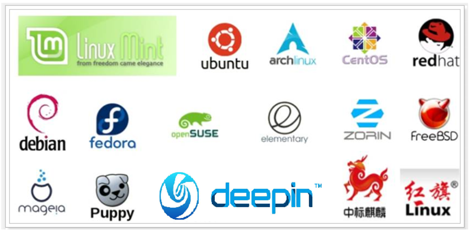
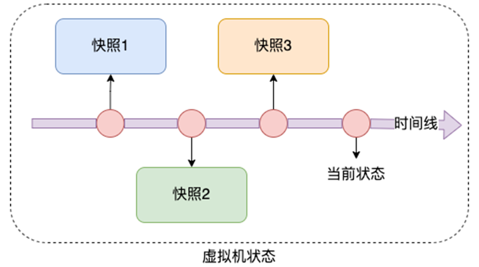

# 1. Linux发行版
内核是免费、开源的，这也就代表了：

任何人都可以获得并修改内核，并且自行集成系统级程序

任何人都可以封装Linux，目前市面上由非常多的Linux发行版，常用的、知名的如下：
提供了内核+系统级程序的完整封装，称之为Linux发行版

# 2. 虚拟机快照

在学习阶段我们无法避免的可能损坏Linux操作系统。

如果损坏的话，重新安装一个Linux操作系统就会十分麻烦。

VMware虚拟机（Workstation和Funsion）支持为虚拟机制作快照。

通过快照将当前虚拟机的状态保存下来，在以后可以通过快照恢复虚拟机到保存的状态。

