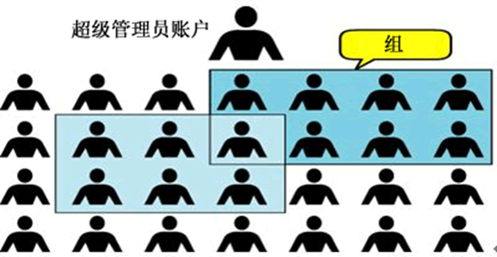
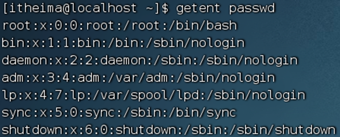
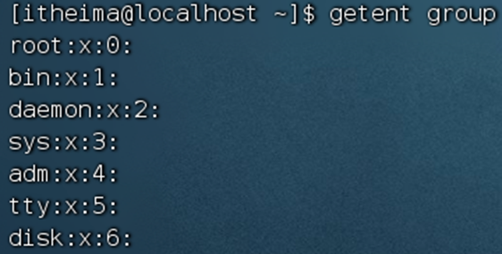
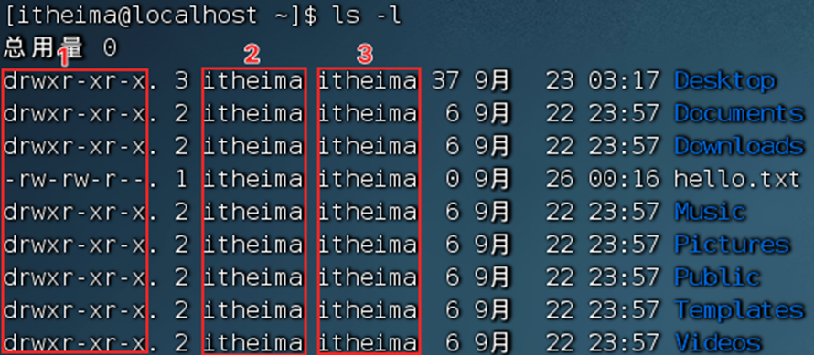
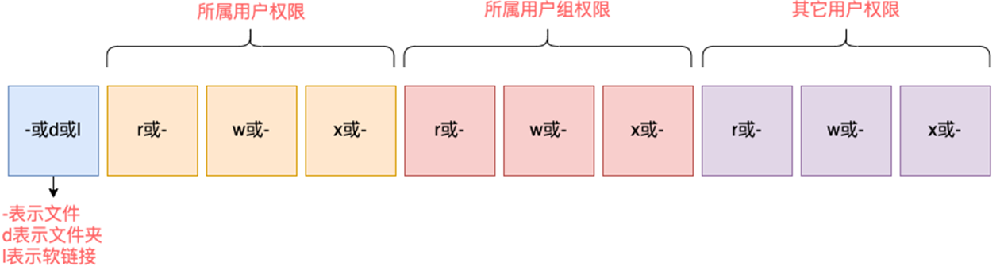
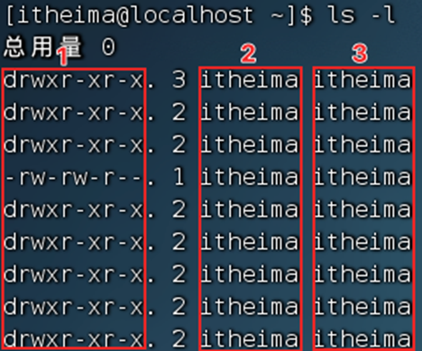

## 3.1 su命令

切换用户

语法：`su [-] [用户]`


## 3.2 exit命令

切换用户后，可以通过exit命令退回上一个用户，也可以使用快捷键：ctrl + d

- 使用普通用户，切换到其它用户需要输入密码，如切换到root用户
- 使用root用户切换到其它用户，无需密码，可以直接切换


## 3.3 sudo命令


### 3.3.1为普通用户配置sudo认证

- 切换到root用户，执行visudo命令，会自动通过vi编辑器打开：/etc/sudoers
- 在文件的最后添加：
```shell
itheima ALL=(ALL)       NOPASSWD: ALL
```
- 其中最后的NOPASSWD:ALL 表示使用sudo命令，无需输入密码。
- 最后通过 wq 保存

在visudo内配置如上内容，可以让itheima用户，无需密码直接使用`sudo`

## 3.4 用户和用户组

Linux系统中可以：
- 配置多个用户
- 配置多个用户组
- 用户可以加入多个用户组中


### **3.4.1 用户组管理**
- 创建用户组
	groupadd 用户组名

- 删除用户组
	groupdel 用户组名

创建一个itcast用户组：groupadd itcast

### **3.4.2 用户管理**
以下命令需root用户执行
1. 创建用户
	**useradd** [-g -d] 用户名
	- 选项：-g指定用户的组，不指定-g，会创建同名组并自动加入，指定-g需要组已经存在，如已存在同名组，必须使用-g
	- 选项：-d指定用户HOME路径，不指定，HOME目录默认在：/home/用户名
2. 删除用户
	**userdel** [-r] 用户名
	- 选项：-r，删除用户的HOME目录，不使用-r，删除用户时，HOME目录保留
3. 查看用户所属组
	**id** [用户名]
	- 参数：用户名，被查看的用户，如果不提供则查看自身
4. 修改用户所属组
	**usermod** -aG 用户组 用户名，将指定用户加入指定用户组

## 3.5 getent命令

1. 使用getent命令，可以查看当前系统中有哪些用户

	语法： `getent passwd`
	
	共有7份信息，分别是：
	
	
	用户名:密码(x):用户ID:组ID:描述信息(无用):HOME目录:执行终端(默认bash)

2. 使用getent命令，同样可以查看当前系统中有哪些用户组
	语法：`getent group`
	
	
	包含3份信息，组名称:组认证(显示为x):组ID


## 3.6 权限

#### 3.6.1 权限信息

通过ls -l 可以以列表形式查看内容，并显示权限细节

序号1，表示文件、文件夹的权限控制信息
序号2，表示文件、文件夹所属用户
序号3，表示文件、文件夹所属用户组

#### 权限细节总共分为10个槽位


**举例：drwxr-xr-x，表示：**

这是一个文件夹，首字母d表示
所属用户(右上角图序号2)的权限是：有r有w有x，rwx
所属用户组(右上角图序号3)的权限是：有r无w有x，r-x （-表示无此权限）
其它用户的权限是：有r无w有x，r-x

**那么，rwx到底代表什么呢？**
- r表示读权限
- w表示写权限
- x表示执行权限

**针对文件、文件夹的不同，rwx的含义有细微差别**
- r，针对文件可以查看文件内容
	针对文件夹，可以查看文件夹内容，如ls命令
- w，针对文件表示可以修改此文件
	针对文件夹，可以在文件夹内：创建、删除、改名等操作
- x，针对文件表示可以将文件作为程序执行
	针对文件夹，表示可以更改工作目录到此文件夹，即cd进入


## 3.7 chmod命令

修改文件、文件夹权限


语法：`chmod [-R] 权限 参数`

- 权限，要设置的权限，比如755，表示：`rwxr-xr-x`

  

- 参数，被修改的文件、文件夹

- 选项-R，设置文件夹和其内部全部内容一样生效


**示例：**
- chmod u=rwx,g=rx,o=x hello.txt ，将文件权限修改为：rwxr-x--x
	其中：u表示user所属用户权限，g表示group组权限，o表示other其它用户权限

- chmod -R u=rwx,g=rx,o=x test，将**文件夹test以及文件夹内全部内容权限**设置为：rwxr-x--x
	除此之外，还有快捷写法：chmod 751 hello.txt

## 3.8 chown命令

修改文件、文件夹所属用户、组

普通用户无法修改所属为其它用户或组，所以此命令只适用于root用户执行

语法：`chown [-R] [用户][:][用户组] 文件或文件夹`


## 用户组管理


## 用户管理


## genenv命令

- `getenv group`，查看系统全部的用户组

  

- `getenv passwd`，查看系统全部的用户

  


## env命令

查看系统全部的环境变量

语法：`env`