## 4.1 各类小技巧

1. ctrl + c 强制停止
2. ctrl + d 退出登出
3. history 查看历史命令
4. !命令前缀，自动匹配上一个命令
5. ctrl + r，搜索历史命令
6. ctrl + a | e，光标移动到命令开始或结束
7. ctrl + ← | →，左右跳单词
8. ctrl + l 或 clear命令 清屏

### 4.1.1 crtl + c 强制停止

- Linux某些程序的运行，如果想要强制停止它，可以使用快捷键ctrl + c
	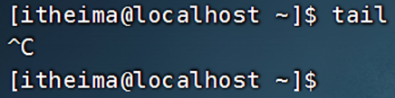

- 命令输入错误，也可以通过快捷键ctrl + c，退出当前输入，重新输入
	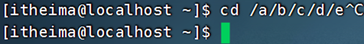

### 4.1.2 crtl + d 退出或登出

- 可以通过快捷键：ctrl + d，退出账户的登录
	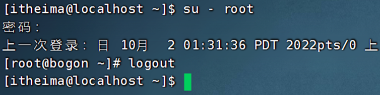

- 或者退出某些特定程序的专属页面
	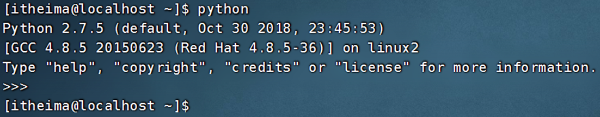

- ps：不能用于退出vi/vim

### 4.1.3 历史命令搜索

- 可以通过history命令，查看历史输入过的命令
	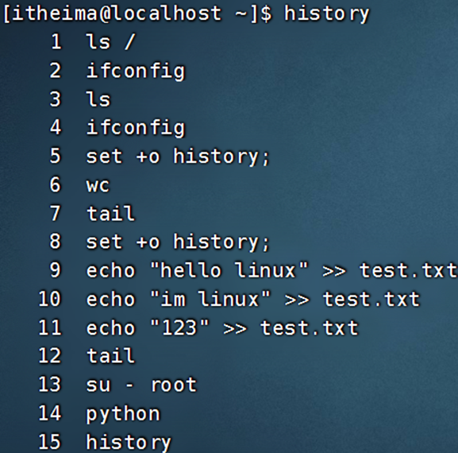

- 可以通过：!命令前缀，自动执行上一次匹配前缀的命令
	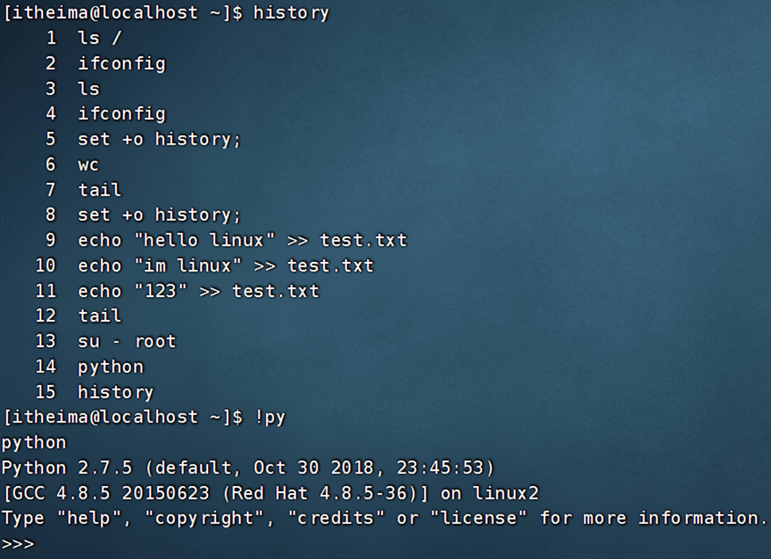

- 可以通过快捷键：ctrl + r，输入内容去匹配历史命令
	

如果搜索到的内容是你需要的，那么：
- 回车键可以直接执行
- 键盘左右键，可以得到此命令（不执行）

### 4.1.4 光标移动快捷键
- ctrl + a，跳到命令开头
- ctrl + e，跳到命令结尾
- ctrl + 键盘左键，向左跳一个单词
- ctrl + 键盘右键，向右跳一个单词

### 4.1.5 清屏
- 通过快捷键ctrl + l，可以清空终端内容
- 或通过命令clear得到同样效果

## 4.2 软件安装

### 4.2.1 yum命令

yum：RPM包软件管理器，用于自动化安装配置Linux软件，并可以自动解决依赖问题。
语法：`yum [-y] [install | remove | search] 软件名称`
- 选项：-y，自动确认，无需手动确认安装或卸载过程
- install：安装
- remove：卸载
- search：搜索

yum命令需要root权限，可以su切换到root，或使用sudo提权。

yum命令需要联网

示例：
- `yum [-y] install wget`， 通过yum命令安装wget程序
	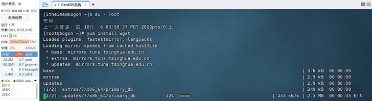
- `yum [-y] remove wget`，通过yum命令卸载wget命令

- `yum search wget`，通过yum命令，搜索是否有wget安装包

### 4.2.2 apt命令 - 扩展
前面学习的各类Linux命令，都是通用的。 但是软件安装，CentOS系统和Ubuntu是使用不同的包管理器。
CentOS使用**yum**管理器，Ubuntu使用**apt**管理器

语法：`apt [-y] [install | remove | search] 软件名称`

用法和yum一致，同样需要root权限
- apt install wget，安装wget
- apt remove wget，移除wget
- apt search wget，搜索wget

## 4.3 systemctl命令

Linux系统很多软件（内置或第三方）均支持使用systemctl命令控制：启动、停止、开机自启
能够被systemctl管理的软件，一般也称之为：服务

语法：`systemctl [start | stop | status | enable | disable] 服务名称`
- start 启动
- stop 关闭
- status 查看状态
- enable 开启开机自启
- disable 关闭开机自启

系统内置的服务比较多，比如：
- NetworkManager，主网络服务
- network，副网络服务
- firewalld，防火墙服务
- sshd，ssh服务（FinalShell远程登录Linux使用的就是这个服务）

除了内置的服务以外，部分第三方软件安装后也可以以systemctl进行控制。

- `yum install -y ntp`，安装ntp软件
	可以通过ntpd服务名，配合systemctl进行控制

- `yum install -y httpd`，安装apache服务器软件
	可以通过httpd服务名，配合systemctl进行控制

## 4.4 软连接

在系统中创建软链接，可以将文件、文件夹链接到其它位置。
类似Windows系统中的《快捷方式》

语法：`ln -s 参数1 参数2`

-s选项，创建软连接
- 参数1：被链接的文件或文件夹
- 参数2：要链接去的目的地

实例：
- ln -s /etc/yum.conf ~/yum.conf
- ln -s /etc/yum ~/yum
	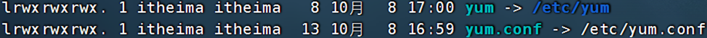


## 4.5 日期和时区

### 4.5.1  date命令

通过date命令可以在命令行中查看系统的时间

语法：`date [-d] [+格式化字符串]`

- -d 按照给定的字符串显示日期，一般用于日期计算
- 格式化字符串：通过特定的字符串标记，来控制显示的日期格式
	- %Y   年
	- %y   年份后两位数字 (00..99)
	- %m   月份 (01..12)
	- %d   日 (01..31)
	- %H   小时 (00..23)
	- %M   分钟 (00..59)
	- %S   秒 (00..60)
	- %s   自 1970-01-01 00:00:00 UTC 到现在的秒数

示例：
- 使用date命令本体，无选项，直接查看时间
	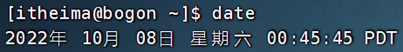
	可以看到这个格式非常的不习惯。我们可以通过格式化字符串自定义显示格式
- 按照2022-01-01的格式显示日期
	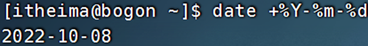
- 按照2022-01-01 10:00:00的格式显示日期
	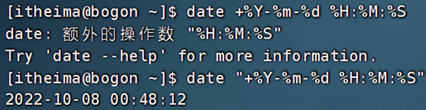
	如上，由于中间带有空格，所以使用双引号包围格式化字符串，作为整体。


**-d选项**，可以按照给定的字符串显示日期，一般用于日期计算

其中支持的时间标记为：
- year年
- month月
- day天
- hour小时
- minute分钟
- second秒
-d选项可以和 格式化字符串配合一起使用

### 4.5.2 修改Linux时区

系统默认时区非中国的东八区。

使用root权限，执行如下命令，修改时区为东八区时区
```sh
rm -f /etc/localtime
sudo ln -s /usr/share/zoneinfo/Asia/Shanghai /etc/localtime
```
将系统自带的localtime文件删除，并将/usr/share/zoneinfo/Asia/Shanghai文件链接为localtime文件即可

### 4.5.3 ntp程序

可以通过ntp程序自动校准系统时间
- 安装ntp：yum -y install ntp
- 启动并设置开机自启：
	- systemctl start ntpd
	- systemctl enable ntpd
	当ntpd启动后会定期的帮助我们联网校准系统的时间

也可以手动校准（需root权限）：ntpdate -u ntp.aliyun.com
通过阿里云提供的服务网址配合ntpdate（安装ntp后会附带这个命令）命令自动校准
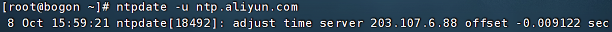

## 4.6 压缩和解压

### 4.6.1 tar 命令

Linux和Mac系统常用有2种压缩格式，后缀名分别是：
- .tar，称之为tarball，归档文件，即简单的将文件组装到一个.tar的文件内，并没有太多文件体积的减少，仅仅是简单的封装
- .gz，也常见为.tar.gz，gzip格式压缩文件，即使用gzip压缩算法将文件压缩到一个文件内，可以极大的减少压缩后的体积

针对这两种格式，使用tar命令均可以进行压缩和解压缩的操作

语法：`tar [-c -v -x -f -z -C] 参数1 参数2 ... 参数N`
- -c，创建压缩文件，用于压缩模式
- -v，显示压缩、解压过程，用于查看进度
- -x，解压模式
- -f，要创建的文件，或要解压的文件，-f选项必须在所有选项中位置处于最后一个
- -z，gzip模式，不使用-z就是普通的tarball格式
- -C，选择解压的目的地，用于解压模式

**tar的常用压缩组合为：**

- tar -cvf test.tar 1.txt 2.txt 3.txt
	将1.txt 2.txt 3.txt 压缩到test.tar文件内

- tar -zcvf test.tar.gz 1.txt 2.txt 3.txt
	将1.txt 2.txt 3.txt 压缩到test.tar.gz文件内，使用gzip模式

**注意：**
- -z选项如果使用的话，一般处于选项位第一个
- -f选项，必须在选项位最后一个

**常用的tar解压组合有**
- tar -xvf test.tar
	解压test.tar，将文件解压至当前目录
- tar -xvf test.tar -C /home/itheima
	解压test.tar，将文件解压至指定目录（/home/itheima）
- tar -zxvf test.tar.gz -C /home/itheima
以Gzip模式解压test.tar.gz，将文件解压至指定目录（/home/itheima）

**注意：**
- -f选项，必须在选项组合体的最后一位
- -z选项，建议在开头位置
- -C选项单独使用，和解压所需的其它参数分开

### 4.6.2 zip 命令压缩文件

可以使用zip命令，压缩文件为zip压缩包

语法：`zip [-r] 参数1 参数2 ... 参数N`
- -r，被压缩的包含文件夹的时候，需要使用-r选项，和rm、cp等命令的-r效果一致

示例：
- zip test.zip a.txt b.txt c.txt
	将a.txt b.txt c.txt 压缩到test.zip文件内
- zip -r test.zip test itheima a.txt
	将test、itheima两个文件夹和a.txt文件，压缩到test.zip文件内

### 4.6.3 unzip 命令解压文件

使用unzip命令，可以方便的解压zip压缩包

语法：`unzip [-d] 参数`
- -d，指定要解压去的位置，同tar的-C选项
- 参数，被解压的zip压缩包文件

示例：
- unzip test.zip、
	将test.zip解压到当前目录
- unzip test.zip -d /home/itheima
	将test.zip解压到指定文件夹内（/home/itheima）