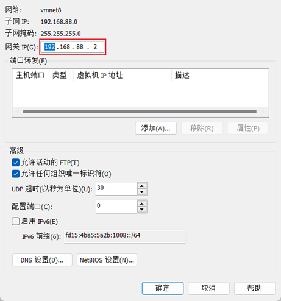

## 5.1 IP地址

> 每一台联网的电脑都会有一个地址，用于和其它计算机进行通讯
> IP地址主要有2个版本，V4版本和V6版本（V6很少用，课程暂不涉及）
> IPv4版本的地址格式是：a.b.c.d，其中abcd表示0~255的数字，如192.168.88.101就是一个标准的IP地址

可以通过命令：`ifconfig`，查看本机的ip地址，如无法使用ifconfig命令，可以安装：`yum -y install net-tools`

### 5.2 特殊IP地址

> 除了标准的IP地址以外，还有几个特殊的IP地址需要我们了解：

- 127.0.0.1，这个IP地址用于指代本机
	
- 0.0.0.0，特殊IP地址
	- 可以用于指代本机
	- 可以在端口绑定中用来确定绑定关系（后续讲解）
	- 在一些IP地址限制中，表示所有IP的意思，如放行规则设置为0.0.0.0，表示允许任意IP访问

## 5.3 主机名

> 每一台电脑除了对外联络地址（IP地址）以外，也可以有一个名字，称之为主机名
> 无论是Windows或Linux系统，都可以给系统设置主机名
- Windows系统主机名
	
- Linux系统主机名
	

#### 在Linux中修改主机名
- 可以使用命令：hostname查看主机名
	
- 可以使用命令：hostnamectl set-hostname 主机名，修改主机名（需root）
	
- 重新登录FinalShell即可看到主机名已经正确显示
	

## 5.4 虚拟机配置固定IP

为什么需要固定IP
当前我们虚拟机的Linux操作系统，其IP地址是通过DHCP服务获取的。

DHCP：动态获取IP地址，即每次重启设备后都会获取一次，可能导致IP地址频繁变更

原因1：办公电脑IP地址变化无所谓，但是我们要远程连接到Linux系统，如果IP地址经常变化我们就要频繁修改适配很麻烦

原因2：在刚刚我们配置了虚拟机IP地址和主机名的映射，如果IP频繁更改，我们也需要频繁更新映射关系

综上所述，我们需要IP地址固定下来，不要变化了。

### 5.4.1 在VMware Workstation中配置固定IP

配置固定IP需要2个大步骤：
在VMware Workstation（或Fusion）中配置IP地址网关和网段（IP地址的范围）
在Linux系统中手动修改配置文件，固定IP
先进行**第一步**，跟随图片进行操作
1. 
2. 
3. 
4. 

进行**第二步**，在Linux系统中修改固定IP
- 使用vim编辑/etc/sysconfig/network-scripts/ifcfg-ens33文件，填入如下内容
	

- 执行：systemctl restart network 重启网卡，执行ifconfig即可看到ip地址固定为192.168.88.130了

### 5.4.2 MacOS 在VMware Fusion中配置固定IP

**步骤一：先修改VMware Fusion的网络设置**

1. 打开Mac系统的终端程序，并执行如下命令：
	
2. 在终端内执行：sudo su - 并输入个人系统密码切换到root用户
	

3. 先备份一下文件：`cp /Library/Preferences/VMware\ Fusion/networking /Library/Preferences/VMware\ Fusion/networking.bakcup`
	通过vim编辑器修改文件：`vim /Library/Preferences/VMware\ Fusion/networking`
	
	修改第11行为如图内容：192.168.88.0，并保存退出

4. 备份文件：`cp /Library/Preferences/VMware\ Fusion/vmnet8/nat.conf /Library/Preferences/VMware\ Fusion/vmnet8/nat.conf.backup`
	修改文件：vim /Library/Preferences/VMware\ Fusion/vmnet8/nat.conf
	
	如图所示在 NAT gateway address下修改：ip为：192.168.88.2（这是网关的IP），并保存退出

5. 启动VMware Fusion，进入Linux虚拟机

**步骤2：在Linux中修改固定IP**

- 在虚拟机的图形化页面中，打开终端，使用su - 切换到root用户
	
- 使用vim编辑`/etc/sysconfig/network-scripts/ifcfg-ens33`文件，填入如下内容
	
- 执行：`systemctl restart network` 重启网卡，执行ifconfig即可看到ip地址固定为192.168.88.130了

## 5.5 ping 命令

> 可以通过ping命令，检查指定的网络服务器是否是可联通状态

语法：`ping [-c num] ip或主机名`
- 选项：-c，检查的次数，不使用-c选项，将无限次数持续检查
- 参数：ip或主机名，被检查的服务器的ip地址或主机名地址

示例：
- 检查到baidu.com是否联通
	
	结果表示联通，延迟8ms左右
- 检查到39.156.66.10是否联通，并检查3次
	

## 5.6 wget 命令

> wget是非交互式的文件下载器，可以在命令行内下载网络文件

语法：`wget [-b] url`
- 选项：-b，可选，后台下载，会将日志写入到当前工作目录的wget-log文件
- 参数：url，下载链接

示例：

- 下载apache-hadoop 3.3.0版本：`wget http://archive.apache.org/dist/hadoop/common/hadoop-3.3.0/hadoop-3.3.0.tar.gz`
	
- 在后台下载：`wget -b http://archive.apache.org/dist/hadoop/common/hadoop-3.3.0/hadoop-3.3.0.tar.gz`
- 通过tail命令可以监控后台下载进度：`tail -f wget-log`

注意：无论下载是否完成，都会生成要下载的文件，如果下载未完成，请及时清理未完成的不可用文件。

## 5.7 curl 命令

> curl可以发送http网络请求，可用于：下载文件、获取信息等

语法：`curl [-O] url`
- 选项：-O，用于下载文件，当url是下载链接时，可以使用此选项保存文件
- 参数：url，要发起请求的网络地址

示例：
- 向cip.cc发起网络请求：curl cip.cc
	
- 向python.itheima.com发起网络请求：`curl python.itheima.com`
- 通过curl下载hadoop-3.3.0安装包：`curl -O http://archive.apache.org/dist/hadoop/common/hadoop-3.3.0/hadoop-3.3.0.tar.gz`

## 5.8 端口

> 端口，是设备与外界通讯交流的出入口。端口可以分为：物理端口和虚拟端口两类

- 物理端口：又可称之为接口，是可见的端口，如USB接口，RJ45网口，HDMI端口等
- 虚拟端口：是指计算机内部的端口，是不可见的，是用来操作系统和外部进行交互使用的

物理端口我们日常生活中经常见到，也能知晓它的作用。
但是虚拟端口，有什么用？为什么需要它呢？

计算机程序之间的通讯，通过IP只能锁定计算机，但是无法锁定具体的程序。
通过端口可以锁定计算机上具体的程序，确保程序之间进行沟通
IP地址相当于小区地址，在小区内可以有许多住户（程序），而门牌号（端口）就是各个住户（程序）的联系地址

Linux系统是一个超大号小区，可以支持65535个端口，**这6万多个端口分为3类进行使用**：

- 公认端口：1~1023，通常用于一些系统内置或知名程序的预留使用，如SSH服务的22端口，HTTPS服务的443端口

非特殊需要，不要占用这个范围的端口
- 注册端口：1024~49151，通常可以随意使用，用于松散的绑定一些程序\服务
- 动态端口：49152~65535，通常不会固定绑定程序，而是当程序对外进行网络链接时，用于临时使用。

如图中，计算机A的微信连接计算机B的微信，A使用的50001即动态端口，临时找一个端口作为出口
计算机B的微信使用端口5678，即注册端口，长期绑定此端口等待别人连接

PS：上述微信的端口仅为演示，具体微信的端口使用非图中示意

### 5.8.1 查看端口占用

可以通过Linux命令去查看端口的占用情况
- 使用nmap命令，安装`nmap：yum -y install nmap`

语法：`nmap 被查看的IP地址`

可以看到，本机（127.0.0.1）上有5个端口现在被程序占用了。
其中：
- 22端口，一般是SSH服务使用，即FinalShell远程连接Linux所使用的端口
---
可以通过netstat命令，查看指定端口的占用情况
安装`netstat：yum -y install net-tools`

语法：`netstat -anp | grep 端口号`

如图，可以看到当前系统6000端口被程序（进程号7174）占用了
其中，0.0.0.0:6000，表示端口绑定在0.0.0.0这个IP地址上，表示允许外部访问

可以看到，当前系统12345端口，无人使用。

## 5.9 上传和下载

我们可以通过FinalShell工具，方便的和虚拟机进行数据交换。

在FinalShell软件的下方窗体中，提供了Linux的文件系统视图，可以方便的：
- 浏览文件系统，找到合适的文件，右键点击下载，即可传输到本地电脑
- 浏览文件系统，找到合适的目录，将本地电脑的文件拓展进入，即可方便的上传数据到Linux中

#### rz、sz命令

当然，除了通过FinalShell的下方窗体进行文件的传输以外，也可以通过rz、sz命令进行文件传输。
rz、sz命令需要安装，可以通过：yum -y install lrzsz，即可安装。
- rz命令，进行上传，语法：直接输入rz即可
- sz命令进行下载，语法：sz 要下载的文件
文件会自动下载到桌面的：fsdownload文件夹中。

注意，rz、sz命令需要终端软件支持才可正常运行
FinalShell、SecureCRT、XShell等常用终端软件均支持此操作