## 6.1 进程
> 程序运行在操作系统中，是被操作系统所管理的。
> 为管理运行的程序，每一个程序在运行的时候，便被操作系统注册为系统中的一个：进程
> 并会为每一个进程都分配一个独有的：进程ID（进程号）

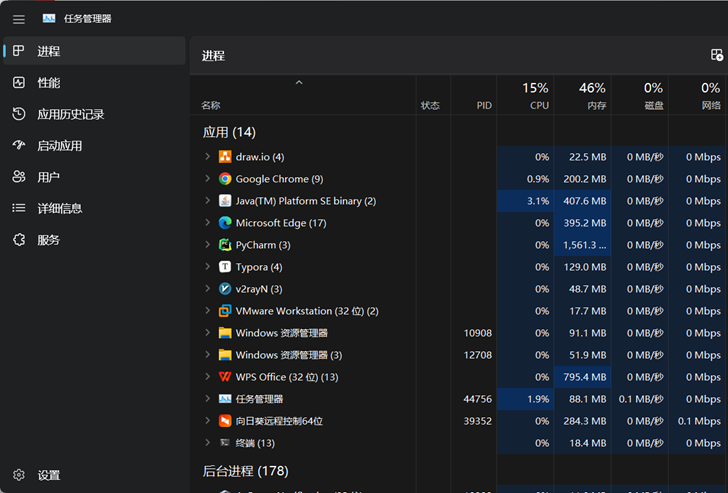
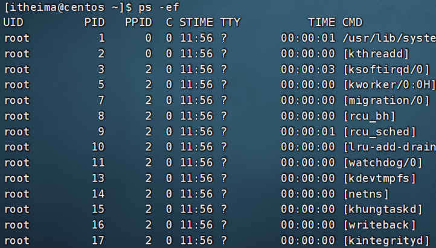

### 6.1.1 查看进程

可以通过ps命令查看Linux系统中的进程信息

语法：`ps [-e -f]`
- 选项：-e，显示出全部的进程
- 选项：-f，以完全格式化的形式展示信息（展示全部信息）

一般来说，固定用法就是： ps -ef 列出全部进程的全部信息
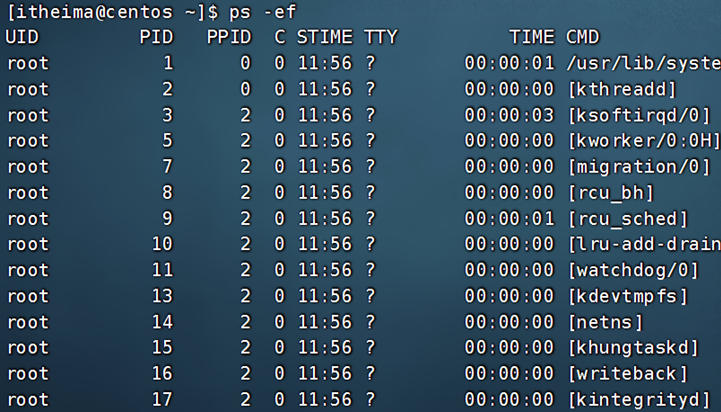
从上到下分别是：

- UID：进程所属的用户ID
- PID：进程的进程号ID
- PPID：进程的父ID（启动此进程的其它进程）
- C：此进程的CPU占用率（百分比）
- STIME：进程的启动时间
- TTY：启动此进程的终端序号，如显示?，表示非终端启动
- TIME：进程占用CPU的时间
- CMD：进程对应的名称或启动路径或启动命令

### 6.1.2 查看指定进程

在FinalShell中，执行命令：tail，可以看到，此命令一直阻塞在那里
在FinalShell中，复制一个标签页，执行：ps -ef 找出tail这个程序的进程信息
问题：是否会发现，列出的信息太多，无法准确的找到或很麻烦怎么办？

我们可以使用管道符配合grep来进行过滤，如：
`ps -ef | grep tail`，即可准确的找到tail命令的信息
	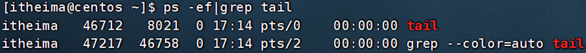

- 过滤不仅仅过滤名称，进程号，用户ID等等，都可以被grep过滤哦
- 如：ps -ef | grep 30001，过滤带有30001关键字的进程信息（一般指代过滤30001进程号）

### 6.1.3 关闭进程

在Windows系统中，可以通过任务管理器选择进程后，点击结束进程从而关闭它。
同样，在Linux中，可以通过kill命令关闭进程。

语法：`kill [-9] 进程ID`

选项：-9，表示强制关闭进程。不使用此选项会向进程发送信号要求其关闭，但是否关闭看进程自身的处理机制。
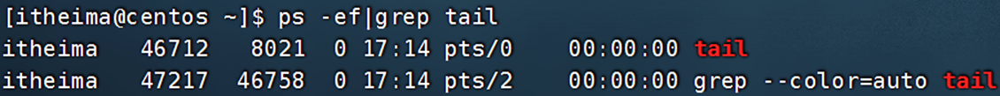
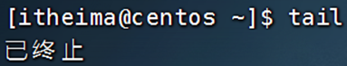
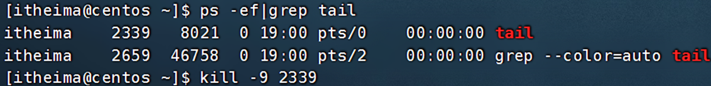
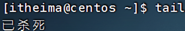

## 6.2 主机状态

### 6.2.1 查看系统资源占用

- 可以通过top命令查看CPU、内存使用情况，类似Windows的任务管理器
  默认每5秒刷新一次，语法：直接输入`top`即可，按q或ctrl + c退出
  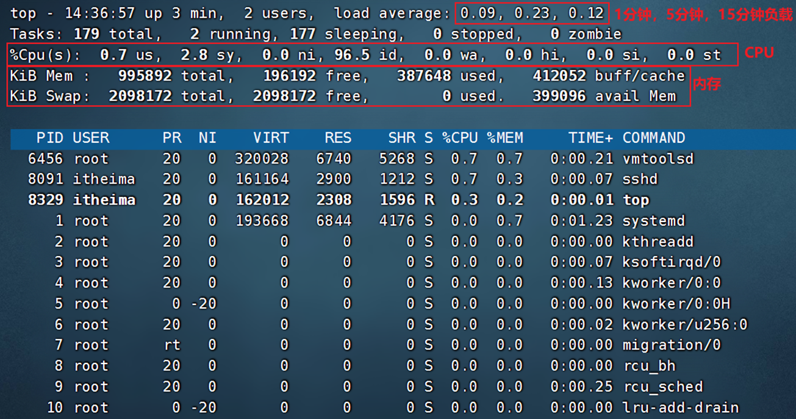

### 6.2.2 top 命令

- 第一行：`top - 10:27:55 up 161 days, 17:28,  2 users,  load average: 0.02, 0.02, 0.00`
	top：命令名称，10:27:55：当前系统时间，up 161 days：启动了161天，2 users：2个用户登录，load：1、5、15分钟负载

- 第二行：`Tasks: 823 total,   1 running, 117 sleeping, 705 stopped,   0 zombie`
	Tasks：823 个进程，1 running：1个进程子在运行，117 sleeping：117个进程睡眠，0个停止进程，0个僵尸进程

- 第三行：`%Cpu(s):  6.0 us,  3.6 sy,  0.0 ni, 90.1 id,  0.0 wa,  0.0 hi,  0.3 si,  0.0 st`
	- %Cpu(s)：CPU使用率
	- us：用户CPU使用率
	- sy：系统CPU使用率
	- ni：高优先级进程占用CPU时间百分比
	- id：空闲CPU率，wa：IO等待CPU占用率
	- hi：CPU硬件中断率
	- si：CPU软件中断率
	- st：强制等待占用CPU率

- 第四、五行：
	`MiB Mem :   1982.9 total,    132.6 free,   1036.1 used,    814.2 buff/cache
	`MiB Swap:   1025.0 total,    858.2 free,    166.8 used.    791.2 avail Mem ``
	
	Kib Mem：物理内存，total：总量，free：空闲，used：使用，buff/cache：buff和cache占用
	
	KibSwap：虚拟内存（交换空间），total：总量，free：空闲，used：使用，buff/cache：buff和cache占用

---
#### 6.2.2.1 top 命令内容详解

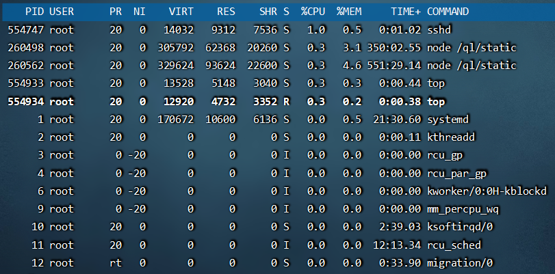
- PID：进程id
- USER：进程所属用户
- PR：进程优先级，越小越高
- NI：负值表示高优先级，正表示低优先级
- VIRT：进程使用虚拟内存，单位KB
- RES：进程使用物理内存，单位KB
- SHR：进程使用共享内存，单位KB
- S：进程状态（S休眠，R运行，Z僵死状态，N负数优先级，I空闲状态）
- %CPU：进程占用CPU率
- %MEM：进程占用内存率
- TIME+：进程使用CPU时间总计，单位10毫秒
- COMMAND：进程的命令或名称或程序文件路径

#### 6.2.2.2 top 命令选项

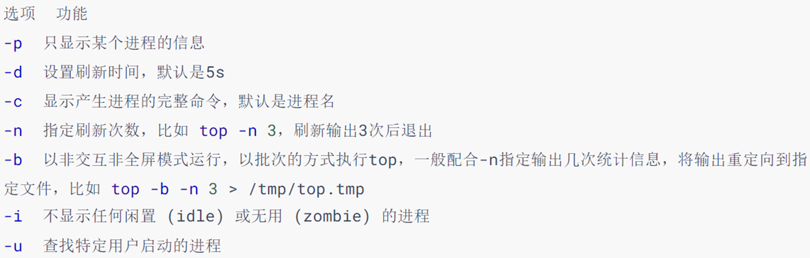

#### 6.2.2.3 top 交互式选项

当top以交互式运行（非-b选项启动），可以用以下交互式命令进行控制

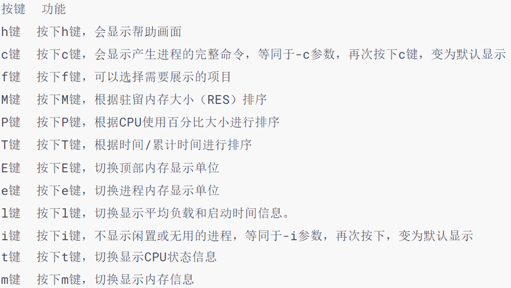

### 6.2.3 磁盘信息监控

#### 6.2.3.1 df 命令
使用df命令，可以查看硬盘的使用情况

语法：`df [-h]`
- 选项：-h，以更加人性化的单位显示

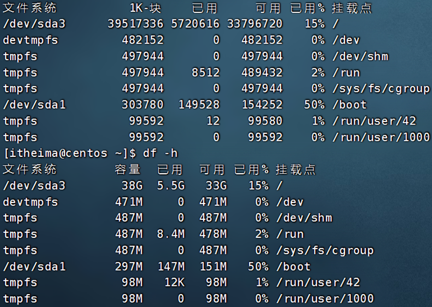

#### 6.2.3.2 iostat 命令

> 可以使用iostat查看CPU、磁盘的相关信息

语法：`iostat [-x] [num1] [num2]`
- 选项：-x，显示更多信息
- num1：数字，刷新间隔，num2：数字，刷新几次

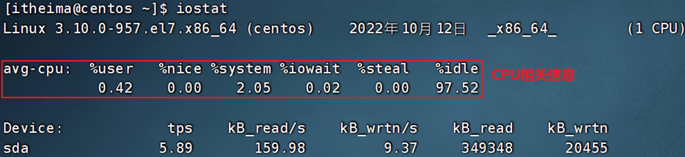

tps：该设备每秒的传输次数（Indicate the number of transfers per second that were issued to the device.）。"一次传输"意思是"一次I/O请求"。多个逻辑请求可能会被合并为"一次I/O请求"。"一次传输"请求的大小是未知的。

**使用iostat的-x选项，可以显示更多信息**
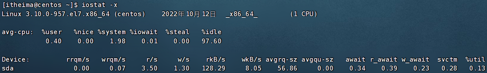
- rrqm/s：	每秒这个设备相关的读取请求有多少被Merge了（当系统调用需要读取数据的时候，VFS将请求发到各个FS，如果FS发现不同的读取请求读取的是相同Block的数据，FS会将这个请求合并Merge, 提高IO利用率, 避免重复调用）；
- wrqm/s：	每秒这个设备相关的写入请求有多少被Merge了。
- rsec/s：	每秒读取的扇区数；sectors
- wsec/：	每秒写入的扇区数。
- rKB/s：	每秒发送到设备的读取请求数
- wKB/s：	每秒发送到设备的写入请求数
- avgrq-sz 	平均请求扇区的大小
- avgqu-sz 	平均请求队列的长度。毫无疑问，队列长度越短越好。    
- await：  	每一个IO请求的处理的平均时间（单位是微秒毫秒）。
- svctm    	表示平均每次设备I/O操作的服务时间（以毫秒为单位）
- %util： 	磁盘利用率

### 6.2.4 网络状态监控

#### 6.2.4.1 sar 命令

> 可以使用sar命令查看网络的相关统计（sar命令非常复杂，这里仅简单用于统计网络）

语法：`sar -n DEV num1 num2`

- 选项：-n，查看网络，DEV表示查看网络接口
- num1：刷新间隔（不填就查看一次结束），num2：查看次数（不填无限次数)

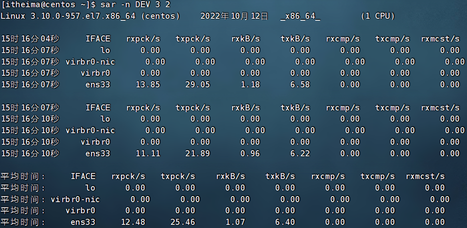
如图，查看2次，隔3秒刷新一次，并最终汇总平均记录

信息解读：
- IFACE 本地网卡接口的名称
- rxpck/s 每秒钟接受的数据包
- txpck/s 每秒钟发送的数据包
- rxKB/S 每秒钟接受的数据包大小，单位为KB
- txKB/S 每秒钟发送的数据包大小，单位为KB
- rxcmp/s 每秒钟接受的压缩数据包
- txcmp/s 每秒钟发送的压缩包
- rxmcst/s 每秒钟接收的多播数据包